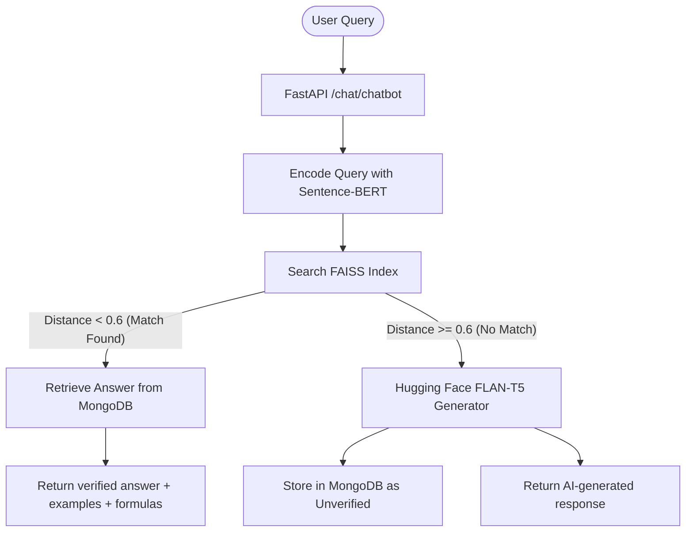

# AcadeMate — KTU Student Support Chatbot

AcadeMate is an AI-powered student support virtual assistant designed specifically for students under the **APJ Abdul Kalam Technological University (KTU)**. It helps students query course details, syllabi, study materials, formulas, and concepts. 

AcadeMate features a **hybrid QA system** utilizing vector search (FAISS) over locally indexed MongoDB questions, with an automatic fallback to generative AI (Hugging Face `flan-t5`) for unanswered queries.

---

## 🏗️ Architecture & Query Flow

AcadeMate implements a hybrid Retrieval-Augmented Generation (RAG) framework:



1. **User Query Input:** The user submits a question through the React frontend along with their branch (e.g., CSE, ECE) and subject.
2. **FAISS Similarity Search:** The query is embedded using the `all-MiniLM-L6-v2` Sentence-BERT model and compared against cached question embeddings using **FAISS**.
3. **MongoDB Lookup (Verified DB):** If a close match is found (L2 distance < 0.6), the application retrieves the verified answer, formulas, and examples from MongoDB.
4. **Hugging Face Fallback (Generative AI):** If no database match is found, the query falls back to a locally run Hugging Face pipeline (`google/flan-t5-large`), which generates a response. This new question and response are stored in MongoDB as an `unverified` entry for administrators to audit and improve the dataset.

---

## 🚀 Key Features

- **Hybrid QA System:** Blends ultra-fast vector search for pre-defined questions with LLM text generation for unknown queries.
- **Syllabus Retriever:** Quick API to search and retrieve syllabus subject breakdowns by branch and semester.
- **Automatic PDF Parsing:** Parses KTU curriculum PDFs on server startup (using PyMuPDF) and saves them as plain text.
- **Authentication system:** Secure registration and login using FastAPI, SQLAlchemy (PostgreSQL), and JWT bearer tokens.
- **Interactive UI:** A polished, modern React frontend featuring:
  - ☀️ Light / 🌙 Dark Mode toggle
  - 📁 Chat history export (`.txt` download)
  - 🤖 Labels highlighting whether a response is "AI-generated" or fetched from the verified DB
  - ⚡ Smooth micro-animations powered by **Framer Motion**

---

## 🛠️ Technology Stack

### Frontend
- **Framework:** React 19 (Vite)
- **Styling:** Custom responsive CSS + Framer Motion for animations
- **Routing:** React Router DOM (v7)
- **HTTP Client:** Axios / Fetch API

### Backend
- **Framework:** FastAPI
- **Web Server:** Uvicorn
- **AI & NLP:**
  - `sentence-transformers` (Sentence-BERT: `all-MiniLM-L6-v2`)
  - `faiss-cpu` (Facebook AI Similarity Search)
  - `transformers` (`google/flan-t5-large` pipeline)
- **PDF Extraction:** PyMuPDF (`fitz`)

### Databases
- **Relational DB:** PostgreSQL (via SQLAlchemy) — manages user authentication and accounts.
- **NoSQL DB:** MongoDB (via PyMongo) — stores syllabus data, parsed documents, and questions.

---

## 📂 Project Structure

```text
├── backend/
│   ├── app/
│   │   ├── auth/              # JWT auth router, DB schemas, and models
│   │   │   ├── auth.py        # Token generation and hashing logic
│   │   │   ├── models.py      # SQLAlchemy User DB model
│   │   │   ├── routes.py      # /auth/signup & /auth/login endpoints
│   │   │   └── schemas.py     # Pydantic schemas for authentication
│   │   ├── chatbot/           # Chatbot Core logic
│   │   │   └── chatbot.py     # FAISS semantic search & LLM fallback API
│   │   ├── utils/             # Helper utilities
│   │   │   ├── gpt_integration.py    # HF FLAN-T5 inference setup
│   │   │   ├── pdf_parser.py         # PyMuPDF extractor
│   │   │   └── security.py           # Password hashing & verification
│   │   ├── config.py          # Environment settings loader
│   │   ├── database.py        # PostgreSQL & MongoDB connection engines
│   │   └── main.py            # FastAPI initialization & startup routines
│   ├── scripts/               # Seeding and utility scripts
│   │   └── insert_syllabus.py # Seeds MongoDB syllabus collections
│   ├── data/                  # Directory storing curriculum PDFs
│   │   └── ktu_pdfs/
│   ├── .env.example           # Example environment file
│   └── requirements.txt       # Python dependencies list
│
├── frontend/
│   ├── src/
│   │   ├── pages/             # Frontend view components
│   │   │   ├── Login.jsx      # Login interface
│   │   │   ├── Signup.jsx     # Registration interface
│   │   │   └── Chatbot.jsx    # Animated Chat dashboard with settings
│   │   ├── App.jsx            # Core component
│   │   ├── main.jsx           # Entrypoint & Router configuration
│   │   └── index.css          # Core design system and dark theme rules
│   ├── package.json           # Node dependencies list
│   └── vite.config.js         # Vite configuration
│
├── cleanup-secrets.sh         # Helper script using BFG to purge exposed keys
└── README.md                  # This file
```

---

## ⚙️ Setup & Installation

### 1. Prerequisites
Make sure you have the following installed on your system:
- Python 3.10+
- Node.js & npm (v18+)
- MongoDB (running locally or a cloud URI)
- PostgreSQL (running locally or a cloud URI)

---

### 2. Backend Configuration

1. Navigate to the backend directory:
   ```bash
   cd backend
   ```
2. Create and activate a Python virtual environment:
   ```bash
   python -m venv .venv
   source .venv/bin/activate  # On Windows: .venv\Scripts\activate
   ```
3. Install dependencies:
   ```bash
   pip install -r requirements.txt
   ```
4. Configure environment variables. Copy `.env.example` to `.env`:
   ```bash
   cp .env.example .env
   ```
5. Edit `.env` to match your local setup:
   ```env
   SECRET_KEY=your_jwt_signing_secret
   ALGORITHM=HS256
   ACCESS_TOKEN_EXPIRE_MINUTES=30
   DATABASE_URL=postgresql://<user>:<password>@localhost:5432/ktudb
   MONGO_URI=mongodb://localhost:27017/
   MODEL_NAME=google/flan-t5-large
   ```
6. (Optional) Initialize your databases:
   - Run the syllabus seeder script to pre-populate syllabus data:
     ```bash
     python scripts/insert_syllabus.py
     ```
   - Seed sample questions:
     ```bash
     python insert_sample_data.py
     ```
7. Start the backend server:
   ```bash
   uvicorn app.main:app --reload --port 8000
   ```
   The backend API documentation will be available at `http://localhost:8000/docs`.

---

### 3. Frontend Configuration

1. Navigate to the frontend directory:
   ```bash
   cd ../frontend
   ```
2. Install dependencies:
   ```bash
   npm install
   ```
3. Start the development server:
   ```bash
   npm run dev
   ```
4. Access the web app at `http://localhost:5173` (or the URL displayed in the terminal).

---

## 🛡️ Security & History Cleanup

If you ever accidentally commit secret tokens or `.env` files:
1. Make sure you have `bfg` installed (`brew install bfg`).
2. Run the cleanup script provided at the root:
   ```bash
   ./cleanup-secrets.sh
   ```
This script runs BFG Repo-Cleaner to delete all `.env` files from Git history, updates `.gitignore`, and force-pushes a clean commit to remote.

---

## 👥 Authors & Contributors

- **Fathima Sana** — [@Fathima-Sana-KT](https://github.com/Fathima-Sana-KT) 
- Rannan
- Shibla Hameed
- Mehnajabin

